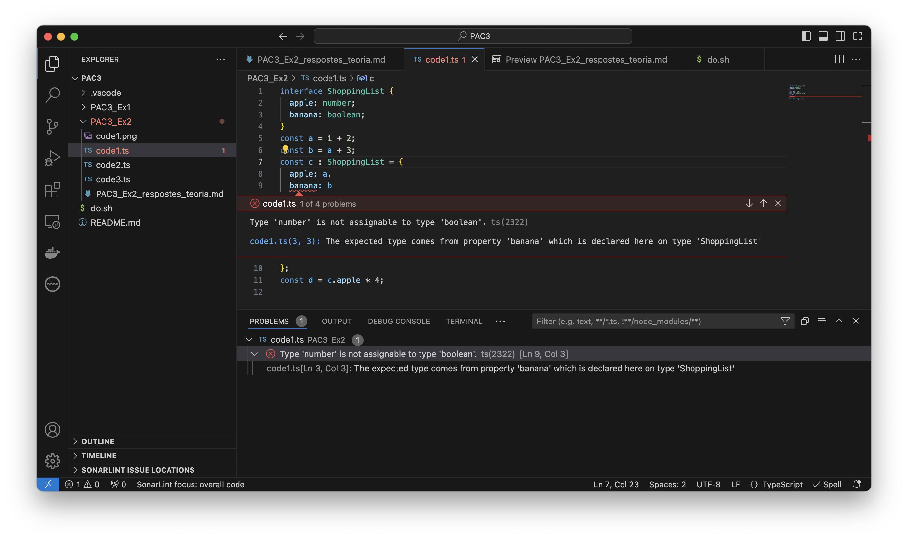

# Exercici 2 – Primers codis a TypeScript (3 punts)
## Modifica el codi de code1.ts per aconseguir un TypeError
```TS
const a = 1 + 2;
const b = a + 3;
const c = {
  apple: a,
  banana: b
};
const d = c.apple * 4;
```

En el codi anterior, `c.banana` és `boolean`, mentre que `b` és `number`. El fet que es mostri aquest tipus d'error, ajuda a corregir errors que serien més difícils de trobar i corregir en JavaScript.
```
$ tsc code1.ts 
code1.ts:9:3 - error TS2322: Type 'number' is not assignable to type 'boolean'.

9   banana: b
    ~~~~~~

  code1.ts:3:3
    3   banana: boolean;
        ~~~~~~
    The expected type comes from property 'banana' which is declared here on type 'ShoppingList'


Found 1 error in code1.ts:9
```
code1.js 
```JS
var a = 1 + 2;
var b = a + 3;
var c = {
    apple: a,
    banana: b
};
var d = c.apple * 4;
```

## Per a cadascun dels valors del fitxer code2.ts, quin tipus de dades inferirà TypeScript? Expliqueu per què s'ha inferit aquest tipus de dades.
```TS
const a = 1042;
const b = 'apples and oranges';
const c = 'pineapples';
const d = [true, true, false];
const e = { type: 'ficus' };
const f = [1, false];
const g = [3];
const h = null;

console.log(`a, tipus: ${typeof a}, valor: ${a}`);
console.log(`b, tipus: ${typeof b}, valor: ${b}`);
console.log(`c, tipus: ${typeof c}, valor: ${c}`);
console.log(`d, tipus: ${typeof d}, valor: ${d}, array? ${d instanceof Array}`);
for (let elem of d)
  console.log(`  tipus: ${typeof elem}, valor: ${elem}`);
console.log(`e, tipus: ${typeof e}, valor: ${e}`);
console.log(`  tipus: ${typeof e.type}, valor: ${e.type}`);
console.log(`f, tipus: ${typeof f}, valor: ${f}, array? ${f instanceof Array}`);
for (let elem of f)
  console.log(`  tipus: ${typeof elem}, valor: ${elem}`);
console.log(`g, tipus: ${typeof g}, valor: ${g}, array? ${g instanceof Array}`);
for (let elem of g)
  console.log(`  tipus: ${typeof elem}, valor: ${elem}`);
console.log(`h, tipus: ${typeof h}, valor: ${h}`);
```

sortida
```
/usr/local/bin/node ./PAC3_Ex2/code2.ts
a, tipus: number, valor: 1042
b, tipus: string, valor: apples and oranges
c, tipus: string, valor: pineapples
d, tipus: object, valor: true,true,false, array? true
  tipus: boolean, valor: true
  tipus: boolean, valor: true
  tipus: boolean, valor: false
e, tipus: object, valor: [object Object]
  tipus: string, valor: ficus
f, tipus: object, valor: 1,false, array? true
  tipus: number, valor: 1
  tipus: boolean, valor: false
g, tipus: object, valor: 3, array? true
  tipus: number, valor: 3
h, tipus: object, valor: null
```

TypeScript intenta inferir en el tipus en la inicialització de les variables.

## Per què es dispara cadascun dels errors del fitxer code3.ts?
```TS
const i: 3 = 3;
i = 4; // Error TS2588 : Cannot assign to 'i' because it is a constant.ts(2588)
```
La variable `i` s'ha definit com a constant i és de tipus primari, per tant no es pot modificar el valor un cop s'ha assignat encara que sigui del mateix tipus.

```TS
const j = [1, 2, 3];
j.push(4);
j.push('5'); // Error TS2345: Argument of type '"5"' is not assignable to parameter of type 'number'.
```
No es pot afegir un `string` a un array on tots els elements de l'array han de ser de tipus `number`, l'array no és multitipus.

```TS
let k: never = 4; // Error TSTS2322: Type '4' is not assignable to type 'never'.
```
No pot ser que la variable no prengui mai cap valor `: never` i després s'assigni un valor `4`.

```TS
let l: unknown = 4;
let m = l * 2; // Error TS2571: Object is of type 'unknown'.
```
No es poden fer operacions aritmètiques amb una variable de tipus `unknown`.

## Quina és la diferència entre una classe i una interfície a TypeScript?

Una interfície s'utilitza únicament per a la verificació de tipus, definint les propietats i els tipus que pot tenir un objecte, i s'eliminen un cop es tanspila el codi a JavaScript. Mentre que una classe, no s'elimina en la transpilació i a part de propietats també té mètodes.